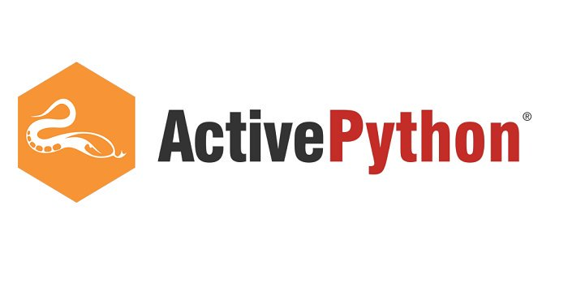
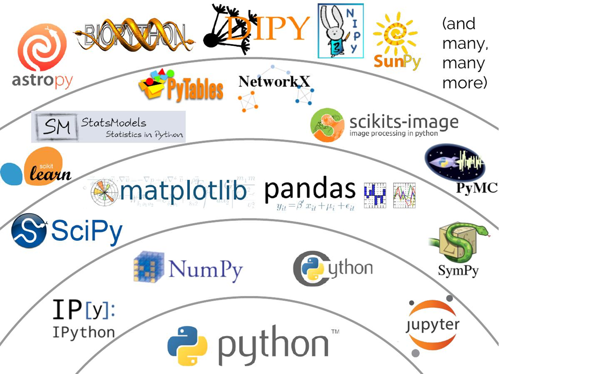

1 基础：背景介绍
================

Python语言难得的既 **简单** 又 **强大** 。它注重的是如何解决问题而不是编程语言的语法和结构。

Python的官方介绍是：

   Python是一种简单易学，功能强大的编程语言，它有高效的高层数据结构，简单而有效地实现面向对象编程。
   Python简洁的语法和对动态输入的支持，再加上解释性语言的本质，使得它在大多数平台上的许多领域都是一个理想的脚本语言，特别适用于快速的应用程序开发。

我会在下一节里详细地讨论Python的这些特点。

名字背后的故事
--------------

Python 的创造者吉多·范罗苏姆（Guido van Rossum）采用 BBC电视节目《蒙提·派森的飞行马戏团（Monty Python’s Flying Circus，一译巨蟒剧团）》的名字来为这门编程语言命名。尽管他本人并不特别喜欢蟒蛇这种用身体勒死猎物来捕食的动物。

Python 的特色
-------------

-  *简单*

Python 是一门简单且简约的语言。阅读一份优秀的 Python
程序代码就如同在阅读英语文章一样，尽管这门英语要求十分严格！Python
这种伪代码式的特质正是它的一大优势。它能够让你专注于解决问题的方案，而不是语言本身。

-  *易学*

就如同你即将看到的一样，Python极其容易上手。前面已经提到了，Python有极其简单的语法。

-  *自由、开源*

Python 是 FLOSS（自由/开放源代码软件）的成员之一。简单来说，你可以自由地分发这个软件的拷贝，
阅读它的源代码，并对其作出改动，或是将其一部分用在新的自由程序中。FLOSS
基于一个可以分享知识的社区理念而创建。这正是 Python 为什么如此优秀的一大原因——它由一群希望看到 Python
能变得更好的社区成员所创造，并持续改进至今。

-  *高级语言*

当你在用 Python 编写程序时，你不必考虑诸如你的程序应当如何使用内存等底层细节。

-  *跨平台*

由于其开放源码的特性，Python 已被移植到其它诸多平台（意即它们已经过改动以保证其能正常工作）。
如果你小心地避开了所有系统依赖型的特性。你所有的 Python 程序可以在其中任何一个平台上工作，不必作出任何改动。

你可以在 GNU/Linux、Windows、FreeBSD、Macintosh、 Solaris、 OS/2、
Amiga、 AROS、 AS/400、 BeOS、 OS/390、 z/OS、 Palm OS、 QNX、 VMS、
Psion、 Acorn RISC OS、 VxWorks、 PlayStation、 Sharp Zaurus、 Windows
CE 以及 PocketPC 平台上运行 Python！

你甚至可以通过诸如 `Kivy <http://kivy.org>`__ 一类的平台来制作可在你的电脑 *以及* iPhone、iPad 或安卓手机上运行的游戏。

-  *解释性*

这一点需要一些解释。

一个用编译性语言比如C或C++写的程序可以从源文件（即C或C++语言）转换到计算机使用的语言（二进制代码，即0和1）。
这个过程通过编译器和不同的标记、选项完成。当你运行程序的时候，连接/转载器软件把程序从硬盘复制到内存中并且运行。

而Python语言写的程序不需要编译成二进制代码。你可以直接从源代码运行程序。在计算机内部，Python解释器把源代码转换成称为字节码的中间形式，然后再把它翻译成计算机使用的机器语言并运行。事实上，由于你不再需要担心如何编译程序，如何确保连接正确的库等等，所有这一切使得使用Python更加简单。只需要把Python程序复制到另外一台计算机上，它就可以工作，这也使得Python程序易于移植。

-  *面向对象*

Python 同时支持面向过程编程与面向对象编程。在 *面向过程* 的编程语言中，程序是由仅仅带有可重用特性的子程序与函数所构建起来的。在
*面向对象* 的编程语言中，程序是由结合了数据与功能的对象所构建起来的。与 C++ 或 Java 这些大型语言相比，Python
具有其特别的、功能强大又简单的方式来实现面向对象编程。

-  *可扩展*

如果你需要代码的某一重要部分能够快速地运行，或希望算法的某些部分不被公开，你可以在 C 或 C++ 语言中编写这些程序，然后再将其运用于你的 Python 程序中。

-  *可嵌入*

你可以在你的 C 或 C++ 程序中嵌入 Python，从而向你的程序用户提供 *脚本* 功能。

-  *丰富的库*

实际上 Python 标准库的规模非常庞大。它能够帮助你完成诸多事情，包括正则表达式、文档生成、单元测试、多线程、数据库、网页浏览器、CGI、FTP、邮件、XML、XML-RPC、HTML、WAV
文件、密码系统、GUI（图形用户界面），以及其它系统依赖型的活动。只需记住，只要安装了 Python，这些功能便随时可用。它们的存在被称作 Python *自备电池（Batteries Included）* 式的哲学。

除了标准库以外，你还可以在 `Python 库索引（Python Package Index） <http://pypi.python.org/pypi>`__ 中找到许多其它高质量的库。

|image4|

小结
~~~~

Python 一门精彩又强大的语言。它恰当地结合了性能与功能，使得编写 Python 程序简单有趣。

对比 Python 3 与 Python 2
-------------------------

如果你对“Python 2”与“Python 3”之间的区别不感兴趣你可以略过本段。但务必注意你正在使用的版本。因为 Python 2 已于2020年1月1日正式停止维护。 本书是以 Python 3 为标准撰写的。

不过一旦你正确理解并学习了一个版本的 Python，便可以很容易地理解另一版本，并能快速学习如何使用。困难的是学习如何编程以及理解
Python 语言本身的基础部分。这便是我们在本书中的目标，而一旦你达成了目标，你便可以根据你的实际情况，决定是该使用 Python 2 还是 Python 3。

要想了解有关 Python 2 和 Python 3 之间的区别的更多细节，你可以参阅：

-  `The future of Python 2 <http://lwn.net/Articles/547191/>`__
-  `Porting Python 2 Code to Python
   3 <https://docs.python.org/3/howto/pyporting.html>`__
-  `Writing code that runs under both Python2 and
   3 <https://wiki.python.org/moin/PortingToPy3k/BilingualQuickRef>`__
-  `Supporting Python 3: An in-depth
   guide <http://python3porting.com>`__

发行版
------

由于 Python 的官方安装包只提供核心功能。包括绘图在内的许多常用模块都需要额外自行安装，而且这些模块经常还会依赖其他更多的模块。
因此有公司或团体将Python和它的编辑器、常用模块等工具打包在一起做成整体的安装包来发布，方便用户使用。这种集成安装包被称为发行版（Distribution）。

Anaconda Python 
~~~~~~~~~~~~~~~
|image0|

`Anaconda Python <https://www.anaconda.com/>`__ 是目前最流行的 Python 发行版。它的名字源于南美洲的一种蟒蛇--水蚺。开源的 Anaconda  Python 整合了科学计算领域中常用的Python库，使它成为了目前在Linux,Windows和Mac上进行Python科学计算和Python机器学习最方便的平台。它能够方便的安装和管理各种Python库和Python环境。在本书中，我们会详细介绍相关用法。

Active Python 
~~~~~~~~~~~~~~~
|image1|

`Active Python <https://www.activestate.com/products/python/>`__ 是ActiveState软件公司发布的二进制Python执行版本，可以为付费用户提供商业支持服务。

Enthought Canopy 
~~~~~~~~~~~~~~~
|image2|

Canopy 是 `Enthought <https://www.enthought.com/>`__ 公司开发维护的 Python 商业发行版，曾叫做EPD(Enthought Python Distribution)。它是 Anaconda 出现之前最完善的 Python 发行版，不过已于2018年停止更新。公司目前推荐使用更加轻便灵活的部署系统EDM（Enthought Deployment Manager）。

.. |image0| image:: ../pic/01/Anaconda_Logo.png
    :width: 256 px

.. |image2| image:: ../pic/01/canopy.png
    :width: 256 px

