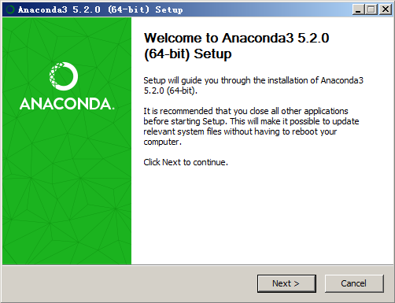
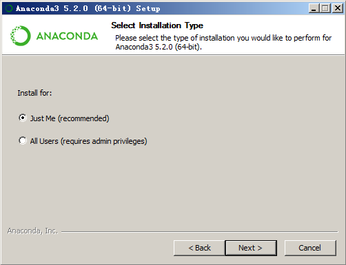
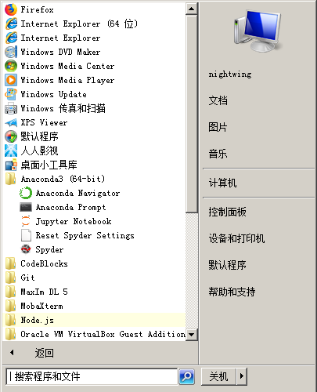
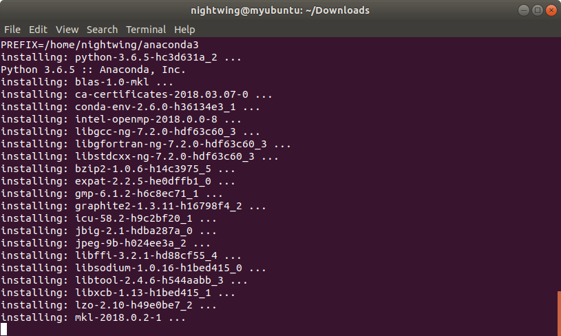
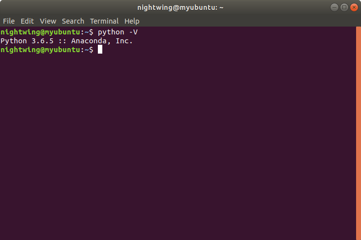
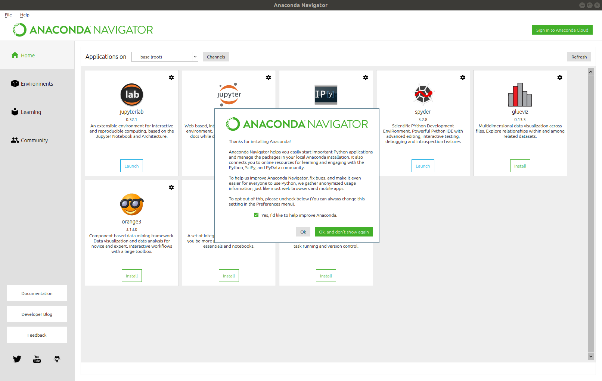
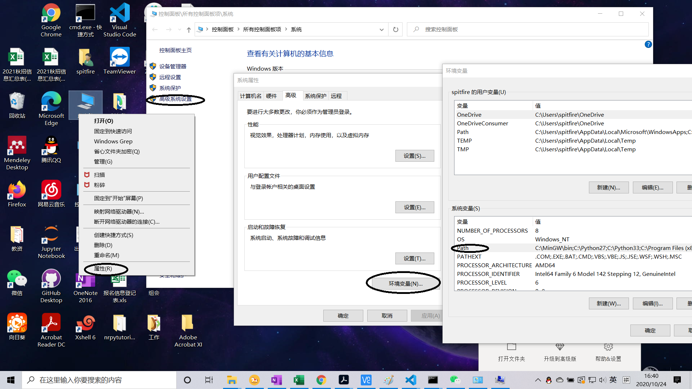
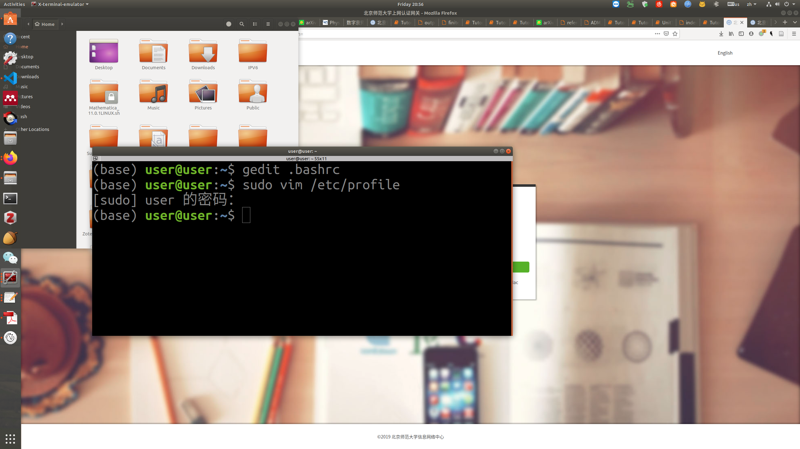

基础：安装
============

我们在本书中提及“Python
3”时，我们指的是\ `Anaconda Python发行版 <https://www.anaconda.com/download/>`__\ 中的Python
3。由于Anaconda Python发行版使Python多版本环境和包的安装管理变得方便灵活，并且集成了适合数据分析和科学计算的工具，使其已成为大多数人安装Python的首选。值得注意的是，通过\ `Python官网 <https://www.python.org/>`__\ 也可以下载各个版本的Python，但其仅仅包含Python解释器，缺乏必要的科学计算和绘图模块，所以这里我们并不推荐。

Anaconda的最新版本可在\ `其官网 <https://www.anaconda.com/products/individual>`__\  或 \ `清华镜像 <https://mirrors.tuna.tsinghua.edu.cn/anaconda/archive/>`__\ 下载。本讲义所用版本为Anaconda3 2019.10（其中包含Python 3.7.3）。

在 Windows 中安装
-----------------

Anaconda的安装过程与Windows平台的其他软件的安装过程无异。具体安装流程如下：

第一步：点击安装包文件，开始我们的安装过程，点击“下一步”。

|image0|

第二步：此处是Anaconda的许可证，点击“同意”才能进入下一步。

|image1|

第三步：此处不推荐安装给所有用户，因为需要管理员权限。选择第一个选项后，只有当前的Windows账户可以使用；若选择第二个选项，则所有登录本机的Windows账户均可使用。由于Windows多账户使用场景较少，所以选择第一个选项足以。

|image2|

第四步：选择你希望的安装路径，前提是有足够的硬盘空间。考虑到程序本身的大小和今后的使用，建议选择剩余空间10GB以上的分区。

|image3|

第五步：此处需注意，在这一步中我们**推荐勾选第一个选项**。这一选项的作用是将Python添加到Windows系统的环境变量PATH中，这样就能在终端cmd中直接运行Python。虽然有提示不建议勾选，但是只要系统中只安装一个版本的Python就不会有什么影响。

|image4|

第六步：Anaconda主体安装完毕后会询问是否安装微软的VSCode编辑器，这里我们选择安装，VSCode是微软开发的一款强大的编辑器，开源，有非常丰富的插件来拓展其功能，本书就是在VSCode上配合
\`Markdown All in One\` 、 \`Markdown PDF\` 和 \`vscode-pdf\`
插件编写的。VSCode可以配合相关插件变成强大的Python开发环境。相关技巧，读者可以在网上查询。

|image5|

第七步：完成安装，点击“完成”。第一个选项勾选后，浏览器会自动打开Anaconda
Cloud的网页，读者可以将Python的包、notebook文件、Python项目以及配置好的Python环境上传到Anaconda
Cloud上，以供存储和分享；第二个选项勾选后，浏览器会自动打开相关网页让读者了解如何使用Anaconda
Python。

|image6|

第八步：在Windows开始菜单中找到Anaconda
Navigator，点击即可启动。Anaconda Navigator是Anaconda
Python各项功能的集合，在其中读者可以通过图形界面方便地安装和管理Python环境和包，以及诸如VSCode和Spyder等工具；菜单中的Anaconda
Prompt是Anaconda Python的命令行界面，可通过相应的命令实现Anaconda
Navigator里的部分功能，比如Python环境和包的安装和管理等，同时也支持Windows系统的命令行指令；Jupyter
Notebook能够在浏览器里编辑Python的Notebook文件，能够实现交互式编程；Spyder是Python的IDE，适用于数据处理和科学计算，界面和功能类似于Matlab。

|image7|

|image8|

在 GNU/Linux 下安装
-------------------

对于GNU/Linux用户，访问 https://www.anaconda.com/download/
并下载最新版本的Anaconda
Python（64位）。需要注意的是几乎每一个Linux发行版自身就带有某一版本的Python，但一般是不推荐直接使用的，一方面是因为其没有Anaconda
Python方便，另一方面是可能会牵扯到Linux系统底层的依赖问题，影响Linux系统的稳定性。具体安装流程如下：

第一步：点击 ``Terminal`` 应用快捷方式或通过按下 ``Ctrl + Alt + T``
组合键打开命令行，用 ``cd Downloads/``
命令切换到下载有安装包的文件夹中，通过 ``ls -l``
命令我们发现安装包默认没有可执行权限，所以我们用
``chmod a+x Anaconda3-5.2.0-Linux-x86_64.sh``
命令赋予安装包可执行权限。之后再用 ``ls -l``
命令查看发现安装包已经可以被执行了，于是使用
``./Anaconda3-5.2.0-Linux-x86_64.sh``
命令来执行安装包，按照命令行中的英文提示，按下 ``Enter``
回车键开始安装过程。

|image9|

第二步：按多次 ``Enter`` 回车键之后，会被询问是否接受license，输入
``yes`` 之后点击 ``Enter`` 回车键。

|image10|

第三步：正式开始安装过程，耐心等待。这一步无需操作。

|image11|

第四步：程序主体安装结束后，会被询问是否将Anaconda
Python加入到环境变量PATH中，这里我们输入 ``yes`` 即可，之后点击
``Enter``\ 回车键继续，方便日后在命令行中的使用。

|image12|

第五步：和Windows安装过程类似，我们会被询问是否安装微软VSCode编辑器，这里我们推荐安装，输入
``yes`` 即可。 （由于笔者已经安装，所以这里输入 ``no`` 掠过了。）

|image13|

第六步：安装完毕，关闭当前终端，重新开启一个新的终端使得安装生效，输入
``python -V``
之后按回车键，我们可以看到此时系统已经开始使用Anaconda版本的Python了。

|image14|

第七步：输入 ``anaconda-navigator &`` 开启Anaconda Navigator。

|image15|

第八步：成功启动，至此安装完毕。值得注意的是与Windows版本不同，Linux版的Anaconda
Python安装完毕之后，系统菜单里并没有相应的快捷方式，Anaconda
Navigator、Jupyter Notebook和Spyder都得在命令行中启动。

|image16|

附注：\ ``$`` 是 Shell
的提示符。根据你电脑所运行的操作系统的设置的不同，它也会有所不同，在之后的内容中我们会使用
``$`` 符号来代表提示符。

注意：输出的内容取决于你安装的Anaconda Python的版本。

在 macOS 下安装
---------------

对于macOS用户，安装过程和Linux类似。通过按键 ``Command + Space``
（以启动 Spotlight 搜索），输入 ``Terminal`` 并按下 ``Enter``
键来启动终端程序。

环境变量
--------

当我们直接使用终端启动程序时，比如直接输入 ``Python`` 然后回车，或者导入一些包时，系统首先需要在一个特定路径搜索，这时候就需要环境变量。不同操作系统下设置环境变量的方法不一样。

Windows ：
----------

1.右键打开 ``我的电脑`` ,点击 ``属性`` 。点击 ``高级系统设置`` ``高级`` 下面的 ``环境变量`` 。

|image17|

2.在 ``环境变量`` 下选择 ``系统变量`` 下的 Path，假如你是在 ``C:\ProgramData\Anaconda3`` 下安装的Anaconda，添加如下三个变量：``C:\ProgramData\Anaconda3`` ``C:\ProgramData\Anaconda3\Library\bin`` ``C:\ProgramData\Anaconda3\Scripts``。如果在WIN7及以下系统，这三个路径需要使用分号隔开.

|image18|

3.点击确定退出


Linux
------

假设安装在~/anaconda3下：

1.使用 ``ctrl+alt+t`` 打开终端，输入 ``gedit .bashrc`` 并回车

|image19|

2.在文件最后插入 ``export PATH=~/anaconda3/bin:$PATH``，保存并退出即可。

|image20|


模块管理器的安装
------------------

我们使用Anaconda最主要的目的是使用它进行模块(module)的管理,关于模块我们将在\ `第九章 <https://github.com/weichen-yan/a-byte-of-python-bnu-rst/edit/master/source/09.modules.rst>`__\进行讨论。在使用import语句导入需要包含的模块之前，我们需要使用Anaconda或者pip这样的管理器进行安装。需要说明的是在Windows，Linux以及MacOS中执行安装模块的命令都是一样的。以numpy模块为例：

Anaconda
在终端中输入 ``conda install numpy`` 并按下 ``Enter`` 即可。类似的，输入 ``conda install -c conda-forge notebook`` 可以安装jupyter notebook.


pip
在终端中输入 ``pip install numpy`` 并按下 ``Enter`` 即可。
在执行这条命令前请确认只安装了Python3.x，虽然我们可以设置同时安装python2.x对应的pip2与pip3，但是鉴于python2.x已经于2020年1月停止维护的事实，除非某些模块必须使用python2.x，否则我们不建议你这样做。具体请搜索 ```python pip2与pip3如何共存```。

总结
----

从现在起，我们将假定你已经在你的系统中安装了Anaconda
Python，和对应的编辑器。接下来，我们将要撰写我们的第一个 Python 程序。


.. |image1| image:: ../pic/02/windows_2.png













.. |image18| image:: ../pic/02/win_env2.png

.. |image20| image:: ../pic/02/linux_env2.png


