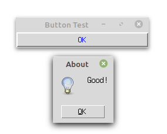
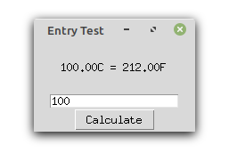

GUI编程
==========

人机交互界面
----------------

用户和计算机之间的交互有多种方式，最初是通过打孔纸带，后来有了命令行终端，今天最主流的是图形窗口，在移动设备上，
手势操作已成为最主要的交互方式。总的来说，交互方式越简单，开发的成本和难度就越高。产品也因此更容易出错。

- CLI (command-line interface):  命令行界面，键盘操作，有稳定的输入输出格式， 特别适合进行协作、批处理或者后台定时任务。
- GUI（Graphical User Interface）: 图形用户界面，适合鼠标点击，学习容易，功能明确，可扩展余地小，操作较CLI少，界面风格有时代性。

图形库--以TK为例
-----------------

目前主流的图形库有以下几种：

- Tk库：一个轻量级的跨平台图形开发工具。由Python创始人编写，python标配，模块为tkinter
- GTK库：跨平台的C语言开源图形开发框架，功能强大，模块为PyGtk
- Qt库：跨平台的C++图形开发框架，模块为PyQt
- wxwidgets：一个开源的跨平台的C++构架库，模块为WxPython，PySide
- MFC(MicrosoftFoundationClasses)：是微软基础类库的简称， 是微软公司实现的一个c++类库，主要封装了大部分的windows API函数。python中调用需要使用模块pywin

Tk库-窗口
~~~~~~~~~~~

.. code:: python

    import tkinter as tk
    root = tk.Tk() # 创建根窗口
    # 在窗口中增加内容
    w =tk.Label(root, text="Hello, world!")
    w.pack() # 打包，根据内容大小设定窗口
    root.mainloop() # 显示窗口直至其关闭

|image01|

Tk库-控件
~~~~~~~~~~~~~~~~

Tk 控件（Widget）:用于画布上各个单元的绘制：

1. Label 标签。用来显示文字或图片
2. Button 按钮。响应鼠标或键盘操作/事件的标签
3. Entry 文本框。单行文字域,用来收集键盘输入
4. Text 文本域。 多行文字区域,可用来收集(或显示）用户输入数字
5. Frame 框架。包含其他组件的纯容器
6. Canvas 画布。提供绘图功能(直线、椭圆、多边形、矩形）以包含位图或图形
7. Message 消息框。类似于标签,但可以显示多行文本
8. Checkbutton 选择按钮。一组方框,可以选其中任意个选项
9. Listbox 列表框。一个选项列表,用户可以从中选择
10. Menu 菜单。点下菜单按钮后弹出的一个用户可以选择的列表
11. Menubutton 菜单按钮。用来包含菜单的组(下拉式，层叠式等)
12. Radiobutton 单选按钮。一组按钮,其中只有一个可被按下
13. Scale 进度条。线性"滑块"组件,可设定起始值和结束值
14. Scrollbar 滚动条。对其支持的组件(文本功能)调节显示范围

…………

Tk库-按钮
~~~~~~~~~~~~

.. code:: python

    import tkinter as tk
    import tkinter.messagebox as tkm
    def callback():
        tkm.showinfo("About", "Good!")

    root = tk.Tk() # 创建根窗口
    root.title("Button Test")	# 定义窗口标题
    tk.Button(root, text="OK",fg="blue",bd=2, width=28, command=callback).pack()
    root.mainloop()

|image02|
按下OK按钮会弹出一个对话窗口。

|image02-1|

关闭窗口

.. code:: python

    import tkinter as tk
    def quit():
        root.destroy()	# 关闭根窗口

    root = tk.Tk() # 创建根窗口
    root.title("Button Test")	# 定义窗口标题
    tk.Button(root, text="Close",fg="blue",bd=2, width=28, command=quit).pack()
    root.mainloop()

|image03|

输入框

.. code:: python

    from tkinter import *
    def a():
        print(E.get())

    root = Tk()
    Label(root,text = "input:").pack(side = LEFT)
    E = Entry(root)
    E.pack(side=LEFT)
    B = Button(root, text = "print", command = a)
    B.pack(side = RIGHT)
    root.mainloop()

|image04|

几何布局
~~~~~~~~~~

针对窗口（画布），我们可以选择不同的布局方式：

 - pack：采用块的方式组织控件，组件简单的布局中代码量最少。默认在父窗体中自顶向下添加组件。
 - grid：采用类似表格的结构组织控件，适合设计对话框和带有滚动条的窗体
 - place：使用绝对坐标将控件放到指定位置
 
pack布局：

.. code:: python

    from tkinter import *
    root = Tk()
    Label(root,text="L1", bg = "red").pack(side = LEFT)
    Entry(root).pack(side=LEFT)
    Label(root,text="L2",bg="green").pack(side = TOP)
    Label(root,text="L3",bg="yellow").pack(side = RIGHT)
    Label(root,text="L4",bg="blue").pack(side = BOTTOM)
    root.mainloop()

|image05|

Grid 布局

.. code:: python

    from tkinter import *
    root = Tk()
    Label(root, text="L1:").grid(row=0)
    Label(root, text="L2:").grid(row=1)
    e1 =	Entry(root).grid(row=0, column=1)
    e2 =	Entry(root).grid(row=1, column=1)
    cbutton = Checkbutton(root, text="checked")
    cbutton.grid(columnspan=2, sticky='E')
    mainloop()

|image06|

文字重设

.. code:: python

    import tkinter as tk 
    def btnClicked():
        cd = float(entryCd.get())
        labelH.config(text = "%.2fC = %.2fF" %(cd, cd*1.8+32))

    top = tk.Tk() 
    top.title("Entry Test")
    labelH = tk.Label(top, text="Convert C to F", height=5, width=20) 
    labelH.pack()
    entryCd = tk.Entry(top, text = "0") 
    entryCd.pack()
    btnCal = tk.Button(top, text = "Calculate", command = btnClicked) 
    btnCal.pack()
    top.mainloop()

|image07| |image07-1|

绘图框

.. code:: python

    import matplotlib as mpl 
    mpl.use("TkAgg")
    from numpy import arange, sin, pi
    from matplotlib.backends.backend_tkagg import FigureCanvasTkAgg 
    import tkinter as Tk
    f=mpl.figure.Figure(figsize=(5, 4), dpi=100)
    a=f.add_subplot(111)
    t=arange(0.0, 3.0, 0.01)
    s=sin(2*pi*t)
    a.plot(t, s)
    root = Tk.Tk()
    canvas = FigureCanvasTkAgg(f, master=root) 
    canvas.draw()
    canvas.get_tk_widget().pack(side=Tk.TOP, fill=Tk.BOTH, expand=1) 
    Tk.mainloop()

|image08|

matplotlibs后端
~~~~~~~~~~~~~~~~

.. list-table:: matplotlib
    list：
    :header-rows: 1

    * - 后端
      - 描述
    * - GTKAgg
      - Agg渲染器输出到GTK绘图面板(需要PyGTK)
    * - GTK
      - GDK渲染器输出到GTK绘图面板(不推荐，需要PyGTK)
    * - GTKCairo 
      - Cairo渲染器输出到GTK绘图面板(需要PyGTK)
    * - WXAgg 
      - Agg渲染器输出到wxWidgets绘图面板（需要wxPython）
    * - WX 
      - 原生wxWidgets绘图输出到wxWidgets绘图面板(不推荐，需要wxPython) 
    * - TkAgg 
      - Agg渲染器输出到Tk绘图面板(需要Tkinter) 
    * - QtAgg 
      - Agg渲染器输出到Qt绘图面板（不推荐，请使用Qt4Agg，需要PyQt）
    * - Qt4Agg 
      - Agg渲染器输出到Qt4绘图面板（需要PyQt4）
    * - FLTKAgg 
      - Agg渲染器输出到FLTK绘图面板(需要pyFLTK, 使用不是很广，考虑使用TKAgg,GTKAgg,WXAgg,或者QT4Agg替代) 
    * - macosx 
      - Cocoa渲染器在osx上。（目前在非交互式模式缺少阻塞show()行为）

根据输入参数画图
~~~~~~~~~~~~~~~~

代码参考 `网址 <http://202.112.85.96/wiki/doku.php/python;example>`_

.. code:: python

    import matplotlib as mpl 
    mpl.use("TkAgg")
    import numpy as np
    from matplotlib.backends.backend_tkagg import FigureCanvasTkAgg 
    import tkinter as Tk

    def rplot():
        n=int(inputEntry.get()) 
        f.clf()
        a = f.add_subplot(111) 
        x = np.random.rand(n,3) 
        c = np.random.rand(n,3)
        a.scatter(x[:,0], x[:,1], s=x[:,2]*500, alpha=0.5, color=c) 
        canvas.draw()
        
    root = Tk.Tk() 
    Tk.Label(root,text="Input:").grid(row=1,column=0) 
    inputEntry=Tk.Entry(root) 
    inputEntry.grid(row=1,column=1) 
    inputEntry.insert(0,"50")
    Tk.Button(root,text="Plot",command=rplot).grid(row=1, column=2,columnspan=3)

    f = mpl.figure.Figure(figsize=(5, 2.5), dpi=100) 
    canvas = FigureCanvasTkAgg(f, master=root) 
    canvas.draw()
    canvas.get_tk_widget().grid(row=0, columnspan=3) 
    Tk.mainloop()

|image09|

画布动画
~~~~~~~~~~

我们画一个球和方块，并让球可以运动：

.. code:: python

    from tkinter import *
    tk = Tk()
    tk.geometry('600x400')
    frame = Frame(tk)
    canvas = Canvas(frame) # use canvas

    frame.pack(fill = BOTH, expand = 1)
    canvas.pack(fill = BOTH, expand = 1)
    box = canvas.create_rectangle(200,200,300,300, fill="red")
    ball = canvas.create_oval(10,10,30,30,fill='blue',tags = 'ball')
    x_move = 2;	y_move = 2
    while True:
    canvas.move(ball, x_move, y_move)	# movement
    canvas.update()
    time.sleep(0.02)

|image10|

鼠标事件
~~~~~~~~~~

.. code:: python

    from tkinter import *

    root= Tk()
    def callback(event):
    print( "clicked at", event.x, event.y)

    frame = Frame(root, width=200,height=200)
    frame.bind("<Button-1>",callback)
    frame.pack()
    root.mainloop()

.. code:: text

    clicked at 116 125
    clicked at 78 91
    clicked at 82 178
    clicked at 158 171

打包
~~~~~

为了让程序能够在其他人的机器上直接执行，我们需要 ``pyinstaller`` 将这些python模块和运行时需要的依赖库文件打包.
在终端下执行以下命令即可安装：

.. code:: text

    pip install pyinstaller
    pyinstaller –F –w tk_ball.py

我们也可以选择其他打包工具

.. list-table:: 打包工具
    list：
    :header-rows: 1

    * - Solution
      - windows
      - linux
      - os x
      - python3
      - license
      - one file mode 
      - zipfile import
    * - bbfreeze
      -   yes
      -   yes
      -   yes
      -   no
      -   MIT
      -   no 
      -   yes
    * - py2exe
      - yes
      - no
      - no
      - yes
      - MIT
      - yes 
      - yes
    * - pyInstaller
      - yes
      - yes
      - yes
      - yes
      - GPL
      - yes
      - no
    * - cx-Freeze
      - yes
      - yes
      - yes
      - yes
      - PSF
      - no 
      - yes
    * - py2app
      - no
      - no
      - yes
      - yes
      - MIT
      - no 
      - yes
        

