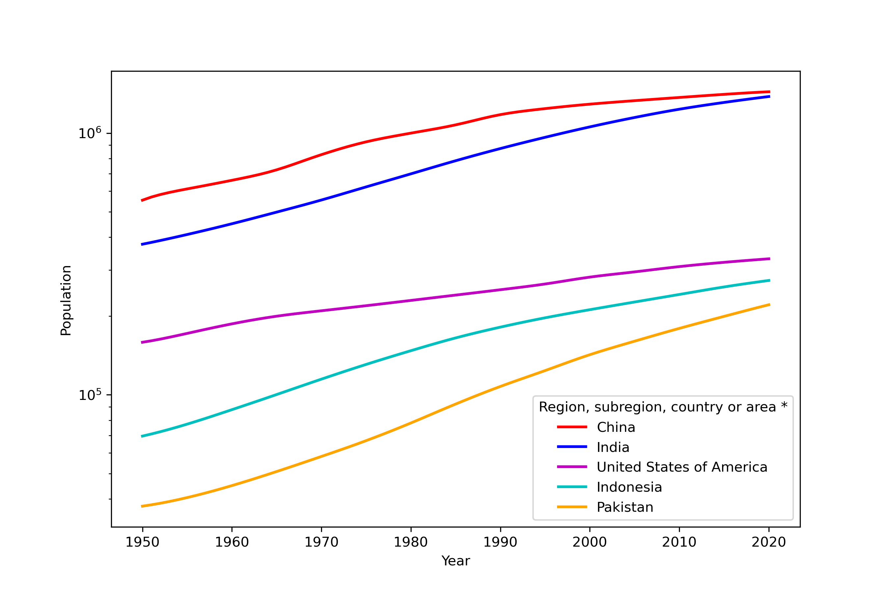

扩展：数据处理模块 Pandas
=========================

Numpy 主要处理结构化数据，适合用于数据量较小并且比较规则的时候。
而 Pandas 基于 NumPy，支持 CSV、Excel、JSON、HTML、SQL、HDF5等多种数据格式，可以用于数据清洗、数据处理与合并、数据可视化等，
能够更灵活、方便地处理大量一致性不好的数据。
Pandas 包含两个主要数据结构：Series 和 DataFrame。下面我们分别来介绍。

更多内容可以参考 Wes McKinney 写的《利用 Python 进行数据分析》中的第 5 章：pandas 入门。

Series
------

Series 是一种类似于一维数组的对象，它由一组数据（各种 NumPy 数据类型）以及一组与之相关的数据标签（索引）组成。
仅由一组数据，使用 ``pandas.Series`` 即可产生最简单的 Series 对象。

Series 的字符串表现形式为：索引在左边，值在右边。
你可以通过 ``Series.values`` 和 ``Series.index`` 属性获取其数组表示形式和索引对象。

首先我们创建一个最简单的 Series 对象

.. code:: python 
    
    import pandas as pd
    population = [3.3, 1.3, 14, 13.5]

    a = pd.Series(population)
    print("The Series is:\n", a)
    print("The values are: \n", a.values)
    print("The index is?\n", a.index)
    print(a[1])
    print(a[:2])    

我们都将得到输出

.. code:: text

    The Series is:
    0     3.3
    1     1.3
    2    14.0
    3    13.5
    dtype: float64
    The values are:
    [ 3.3  1.3 14.  13.5]
    The index is?
    RangeIndex(start=0, stop=4, step=1)
    1.3
    0    3.3
    1    1.3
    dtype: float64

通常，我们希望所创建的 Series 带有一个可以对各个数据点进行标记的索引

.. code:: python

    country = ["USA", "JP", "CHN", "IND"]
    b = pd.Series(population, country)
    print(b[1])
    print(b["USA"])
    print(b[:"CHN"])

得到输出

.. code:: text

    1.3
    3.3
    USA     3.3
    JP      1.3
    CHN    14.0
    dtype: float64

**我们也可以使用字典创建 Series**

.. code:: python

    import pandas as pd

    data = {"USA":3.3, "JP":1.3, "CH":14, "IN":13.5}
    c = pd.Series(data)
    print(c)
    print(c["CH"])

输出

.. code:: text

    USA     3.3
    JP      1.3
    CH     14.0
    IN     13.5
    dtype: float64
    14.0

Index and Indexer
-----------------

用索引（Index）可以进行数据筛选，利用上一节已经生成的 Series，我们进行这一部分的练习。最简单的索引有下面两种方式

.. code:: python
    
    # 方式一
    d = pd.Series(data, index=["USA", "CH"])
    print(d)
    print()

    # 方式二
    # 不连续数字索引
    e = pd.Series(population, index=[5, 3, 10, 6])
    print(e)
    # 显式索引：明确给出数据行的标签
    print(e[5]) # 输出标签为 5 的数据
    # 隐式索引：默认的数据行编号
    print(e[:2]) # 输出前两行的数据

输出

.. code:: text

    USA     3.3
    CH     14.0
    dtype: float64
    
    5      3.3
    3      1.3
    10    14.0
    6     13.5
    dtype: float64
    3.3
    5    3.3
    3    1.3
    dtype: float64

或者我们也可以使用索引器（Indexer）进行索引，索引器有三种

- ``loc`` ：显式索引，也就是标签（label based indexing）
- ``iloc`` ：隐式索引，也就是位置（positional indexing）
- ``ix`` ：前两种索引的混合模式，主要用在 DataFrame 中

下面是一个使用索引器 ``loc`` 和 ``iloc`` 对 Series 进行数据筛选的例子

.. code:: python

    # 方式三
    # 使用索引器
    print(e.loc[3])
    print(e.loc[:3])
    print(e.iloc[3])
    print(e.iloc[:3])

输出

.. code:: text

    1.3
    5    3.3
    3    1.3
    dtype: float64
    13.5
    5      3.3
    3      1.3
    10    14.0
    dtype: float64    

Series 更新
-----------

更新已有标签的数值

.. code:: python

    c[1] = 2
    # 或使用索引器
    c.loc["JP"] = 2
    c.iloc[1] = 2

添加数据

.. code:: python

    s1 = pd.Series([1, 2, 3])
    s2 = pd.Series([4, 5, 6])

    print(s1.append(s2))
    print(s1.append(s2, verify_integrity=True))

输出

.. code:: text

    0    1
    1    2
    2    3
    0    4
    1    5
    2    6
    dtype: int64
    ...
    ValueError: Indexes have overlapping values: Int64Index([0, 1, 2], dtype='int64')

上面第二个 ``print`` 语句报错了，是因为 ``verify_integrity=True`` 意味着如果存在重复的标签就会报错。
如果想要不引起报错，可以用下面的方法

.. code:: python

    s1 = pd.Series([1, 2, 3])

    # 为数据指定标签值
    s2 = pd.Series([4, 5, 6], index=[3, 4, 5])
    print(s1.append(s2))

    # 或者直接忽略标签值
    s2 = pd.Series([4, 5, 6])
    print()
    print(s1.append(s2, ignore_index=True))

输出都是没问题的

.. code:: text

    0    1
    1    2
    2    3
    3    4
    4    5
    5    6
    dtype: int64
    
    0    1
    1    2
    2    3
    3    4
    4    5
    5    6
    dtype: int64
    
DataFrame
---------

DataFrame 是一个表格型的数据结构，它含有一组有序的列，每列可以是不同的值类型（数值、字符串、布尔值等）。
DataFrame 既有行索引也有列索引，它可以被看做由 Series 组成的字典（共用同一个索引）。
跟其他类似的数据结构相比（如 R 语言的 ``data.frame`` ），DataFrame 中面向行和面向列的操作基本上是平衡的。
其实，DataFrame 中的数据是以一个或多个二维块存放的（而不是列表、字典或别的一维数据结构）。

首先我们来看一下 Series 和 DataFrame 有什么区别

.. code:: python

    import pandas as pd

    s = pd.Series([1,2,3,4,5])
    print(s)
    print()

    df = pd.DataFrame(s)
    print(df)

输出

.. code:: text

    0    1
    1    2
    2    3
    3    4
    4    5
    dtype: int64

         0 
    0    1
    1    2
    2    3
    3    4
    4    5

可以看到 DataFrame 不仅有行的标签，还有列的标签。我们可以通过下面这些方法创建 DataFrame

.. code:: python

    import pandas as pd
    import numpy as np

    population = [3.3, 1.3, 14, 13.5]
    country = ["USA", "JP", "CHN", "IND"]

    # 方法一
    # 通过字典创建
    df = pd.DataFrame({"COU": country, "PEO": population})
    print(df)
    print()

    # 在通过字典创建的时候，如果有的值并不存在，则自动用 NaN 填充，例如
    dl = [{"a":1, "b":1}, {"b":2, "c":2}, {"c":3, "d":3}]
    df = pd.DataFrame(dl)
    print(df)
    print()

    # 方法二
    # 通过 Numpy 二维数组创建
    df = pd.DataFrame( np.zeros([5,3]),
                       columns=["A", "B", "C"],
                       index=["a", "b", "c", "d", "e"] )
    print(df)

输出

.. code:: text

       COU   PEO
    0  USA   3.3
    1   JP   1.3
    2  CHN  14.0
    3  IND  13.5

         a    b    c    d
    0  1.0  1.0  NaN  NaN
    1  NaN  2.0  2.0  NaN
    2  NaN  NaN  3.0  3.0

         A    B    C
    a  0.0  0.0  0.0
    b  0.0  0.0  0.0
    c  0.0  0.0  0.0
    d  0.0  0.0  0.0
    e  0.0  0.0  0.0

**二维数据表的一些常用属性和方法**

.. code:: python

    import pandas as pd

    data = {
    'CHN': {'COUNTRY': 'China', 'POP': 1398, 'AREA': 9597,'IND_DAY': '1949-10-01'},
    'IND': {'COUNTRY': 'India', 'POP': 1351, 'AREA': 3287},
    'USA': {'COUNTRY': 'US', 'POP': 329, 'AREA': 9833, 'IND_DAY': '1776-07-04'}}

    df = pd.DataFrame(data)
    print(df)
    print()
    print(df.dtypes) # 数据类型
    print()
    print(df.columns) # 列标签
    print()
    print(df.index) # 行标签
    print()
    print(df['CHN']) # 按列索引，返回一个 Series
    print()
    print(type(df['CHN']))
    print()
    print(df.loc['POP']) # 按行索引，返回一个 Series
    print()
    print(type(df.loc['POP']))

输出

.. code:: text

                    CHN    IND         USA
    AREA           9597   3287        9833
    COUNTRY       China  India          US
    IND_DAY  1949-10-01    NaN  1776-07-04
    POP            1398   1351         329

    CHN    object
    IND    object
    USA    object
    dtype: object

    Index(['CHN', 'IND', 'USA'], dtype='object')

    Index(['AREA', 'COUNTRY', 'IND_DAY', 'POP'], dtype='object')

    AREA             9597
    COUNTRY         China
    IND_DAY    1949-10-01
    POP              1398
    Name: CHN, dtype: object

    <class 'pandas.core.series.Series'>

    CHN    1398
    IND    1351
    USA     329
    Name: POP, dtype: object

    <class 'pandas.core.series.Series'>

**数据类型**

- object：字符串类型
- int：整型
- float：浮点型
- datetime：时间类型
- bool：布尔型

**二维数据的筛选**

.. code:: python

    df = pd.DataFrame(data=data, index=['POP','AREA']).T
    df['POP'] # 返回列
    df[1:2] # 返回行
    df[1:2][:2]
    df['POP'][3:6]
    df[3:6]['POP']
    df.loc[1] # 返回单列数据
    df.loc[1:3] # 返回切片列数据
    df.loc[:4,['POP']] # 返回指定行的指定类
    df.iloc[:2,1:3] # 返回特定行特定列的数据

Excel to DataFrame
------------------

联合国经济和社会事务部（WPP）每年都会发布世界人口数据，可以从下面这个链接下载

https://population.un.org/wpp/Download/Standard/Population/

下载到的是一个 Excel 文件。常用的读取 Excel 文件用到的一些方法

.. code:: python

    import pandas as pd

    # 读取整个文件
    df = pd.read_excel('WPP2019_POP.xlsx') 
    # 发现它有 304 行 78 列
    df.shape
    # 读取第二个标签页，默认 sheet_name=0
    df = pd.read_excel('WPP2019_POP.xlsx', sheet_name=1)
    # 读取标签页名为 ESTIMATES 的数据
    df = pd.read_excel('WPP2019_POP.xlsx', sheet_name='ESTIMATES')
    # 读取第 8 列数据
    df = pd.read_excel('WPP2019_POP.xlsx', usecols=[7])
    # 虽然只读取列一列数据，但这依然是一个 DataFrame
    type(df)
    # 读取第 8 列数据 
    df = pd.read_excel('WPP2019_POP.xlsx', usecols=[7], squeeze=True)
    # squeeze=True 表示如果只有一列数据被读入，那么返回一个 Series
    type(df)
    # 读入的时候忽略前 16 行
    df = pd.read_excel('WPP2019_POP.xlsx', header=16)
    # 返回前 5 行数据
    df.head()

用微软或者金山 Excel 打开它会发现数据表的前 16 行是一些关于数据的说明，第二列是国家的名称，我们以国家的名称作为 DataFrame 的标签，将这个 Excel 读入，之后将对这个 DataFrame 进行处理

.. code:: python
    
    # Excel 读入
    df = pd.read_excel('WPP2019_POP.xlsx', header=16, index_col=2)

    # Excel 保存
    df.to_excel("output.xlsx")
    df.to_excel("output.xlsx", sheet_name='UNpop')
    df.to_excel("output.xlsx", index=False)
    df.to_csv("output.csv", sep="\t")
    df.to_html("output.html")

**数据整理**

.. code:: python

    # 前 6 行书中国的区号等信息
    df.loc['China']
    # 提取中国 1950-2020 年的人口数据
    df.loc['China'][6:]

    # 检查所在行号
    check = df.index.isin(['China'])
    np.argwhere(check == True)

    # 转为 numpy 数组
    # pandas version>=0.24.1
    df.loc['China'][6:].to_numpy() 

**数据排序**

.. code:: python

    df.sort_index(axis=0) # 行标签
    df.sort_index(axis=1, ascending=False) # 列标签排序
    df.sort_values('1950') # 按照 1950 年的人口排序

    df1 = df.replace('...', 0)
    df1.sort_values('1950', ascending=False)

基于 Numpy 的运算
-----------------

Pandas 基于 Numpy，运算结果保留索引和列标签，而且自动对齐索引，没有数据的位置自动用 NaN 填充。

**Series 的运算**

.. code:: python

    import pandas as pd
    import numpy as np

    s1 = pd.Series({"A": 1, "B":2, "D":4, "E":5}, name="ONE")
    print(s1)
    # 如果数据类型是整型或者浮点型，可以 Numpy 进行运算
    print(np.sqrt(s1))

    s2 = pd.Series({ "D":4, "E":5, "F":6}, name="TWO")
    # 两个 Series 可以相加，没有数据的位置会用 NaN 填充
    print(s1 + s2)
    # 使用 Series.add 方法可以用避免 NaN 填充
    print(s1.add(s2, fill_value=100))

输出

.. code:: text

    A    1
    B    2
    D    4
    E    5
    Name: ONE, dtype: int64

    A    1.000000
    B    1.414214
    D    2.000000
    E    2.236068
    Name: ONE, dtype: float64

    A     NaN
    B     NaN
    D     8.0
    E    10.0
    F     NaN
    dtype: float64

    A    101.0
    B    102.0
    D      8.0
    E     10.0
    F    106.0
    dtype: float64

**DataFrame 的运算**

.. code:: python

    import pandas as pd
    import numpy as np

    A1 = np.random.randint(10, size=(3,5))
    df1 = pd.DataFrame(A1, columns=list("ABCDE"))
    print(df1)

    # 按行计算
    # 所有数据减去第二行
    df2 = df1 - df1.iloc[1]
    print(df2)

    # 按列运算
    # 所有数据减去 B 列
    df3 = df1.subtract(df1["B"], axis=0)
    print(df3)

输出

.. code:: text

       A  B  C  D  E
    0  5  3  3  7  5
    1  3  5  9  7  1
    2  3  8  1  8  8

       A  B  C  D  E
    0  2 -2 -6  0  4
    1  0  0  0  0  0
    2  0  3 -8  1  7

       A  B  C  D  E
    0  2  0  0  4  2
    1 -2  0  4  2 -4
    2 -5  0 -7  0  0 

Pandas 绘图
-----------

我们用世界人口数据进行绘图练习。画出 2020 年世界人口前五的国家人口从 1950 到 2020 年的人口变化。

.. code:: python

    import pandas as pd
    import matplotlib.pyplot as plt

    df = pd.read_excel('WPP2019_POP.xlsx', header=16, index_col=2)

    # 筛选国家，按照 2020 年人口降序排序，提取处前五的国家
    df_c = df.loc[df['Type'] == 'Country/Area'].sort_values('2020', ascending=False)[:5]

    fig, ax = plt.subplots(figsize=(9, 6))
    # 可以进行丰富的属性配置
    df_c.iloc[:, 6:].T.plot(ax=ax,
            xlabel='Year',
            ylabel='Population',
            logy=True, # 因为不同国家的人口相差太大，使用对数坐标系
            color=['r', 'b', 'm', 'c', 'orange'],
            lw=2)
    plt.show()

得到下图

|image0|

数据合并
--------

``concat()`` 、 ``append()`` 、 ``merge()`` 一般都是用来连接两个或者多个 Series 或 DataFrame 对象。
其中 ``concat()`` 默认用来纵向连接 DataFrame 对象， ``merge()`` 用来横向连接 DataFrame 对象。
这里给出  ``concat()`` 和 ``merge()`` 的例子。

**concact() 合并**

.. code:: python

    import pandas as pd

    # Series 合并
    s1 = pd.Series(list("ABC"), index =[1,2,3])
    s2 = pd.Series(list("DEF"), index =[4,5,6])
    print(pd.concat([s1, s2]))

    # DataFrame 合并
    df1 = pd.DataFrame([['a', 1], ['b', 2]], columns=['A','B'])
    df2 = pd.DataFrame([['c', 3], ['d', 4]], columns=['A','B'])
    print(pd.concat([df1, df2]))
    print(pd.concat([df1, df2], ignore_index=True))
    print(pd.concat([df1, df2], keys=["C", "D"]))

输出

.. code:: text

    1    A
    2    B
    3    C
    4    D
    5    E
    6    F
    dtype: object

       A  B
    0  a  1
    1  b  2
    0  c  3
    1  d  4

       A  B
    0  a  1
    1  b  2
    2  c  3
    3  d  4

         A  B
    C 0  a  1
      1  b  2
    D 0  c  3
      1  d  4 

**merge() 合并**

.. code:: python

    import pandas as pd

    df1 = pd.DataFrame([['a', 1], ['b', 2],['c',3]], columns=['A','B'])
    df2 = pd.DataFrame([['c', 3, 2], ['d', 4, 5]], columns=['E','B','C'])
    print(df1)
    print(df2)
    # 使用 concact 合并，没有的数据将用 NaN 填充
    print(pd.concat([df1, df2], ignore_index=True))
    # 直接 merge 数据，取两个数据的并集
    print(pd.merge(df1, df2))
    # inner 是默认的合并方式，使用两组数据公有列名合并
    # outer 使用两组数据的全部列名
    print(pd.merge(df1, df2, how='outer'))
    # left 使用左侧数据的列名
    print(pd.merge(df1, df2, how='left'))
    # right 使用右侧数据列名
    print(pd.merge(df1, df2, how='right'))

输出

.. code:: text

       A  B
    0  a  1
    1  b  2
    2  c  3

       E  B  C
    0  c  3  2
    1  d  4  5

         A  B    E    C
    0    a  1  NaN  NaN
    1    b  2  NaN  NaN
    2    c  3  NaN  NaN
    3  NaN  3    c  2.0
    4  NaN  4    d  5.0

       A  B  E  C
    0  c  3  c  2

         A  B    E    C
    0    a  1  NaN  NaN
    1    b  2  NaN  NaN
    2    c  3    c  2.0
    3  NaN  4    d  5.0

       A  B    E    C
    0  a  1  NaN  NaN
    1  b  2  NaN  NaN
    2  c  3    c  2.0

         A  B  E  C
    0    c  3  c  2
    1  NaN  4  d  5

